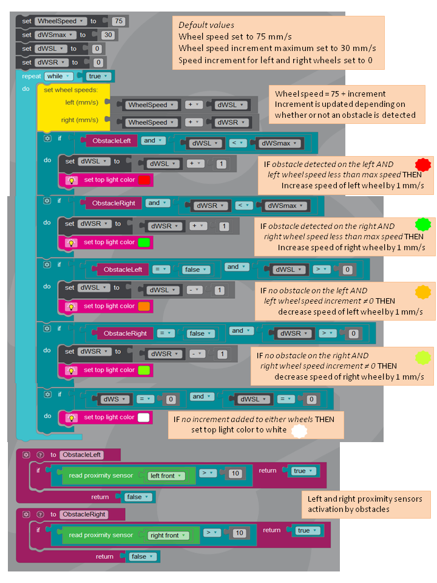
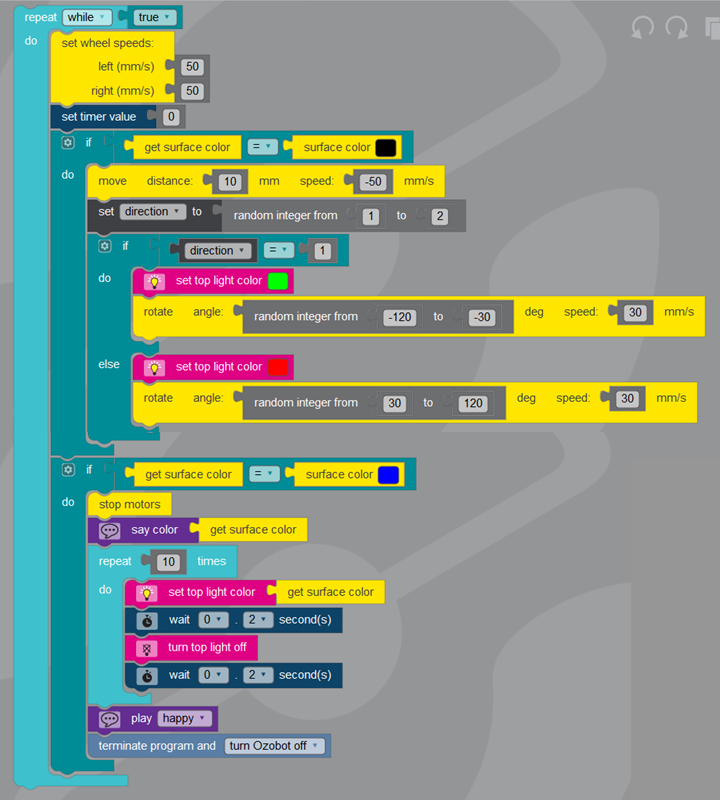

# Ozobot-Evo
Codes for Ozobot Evo

- AutonomousOzobot.js makes Ozobot Evo roll at constant speed and turn left or right to avoid obstacles. When an obstacle is detected on the left by the IR left front sensor, the left wheel speed is increased until the obstacle is no longer detected. The same approach is used if an obstacle is detected on the right.

Below an image file of the Ozoblockly code with some comments.

- RandomExplorationOfSpace.js makes it possible for Ozobot Evo randomly to explore space. The space to explore is delimited by black lines. Ozobot stops its exploration when it finds a blue spot. As for the algorithm, when Evo's color detector detects black color, it steps 1 centimeter back, then randomly turns left or right with a random angle between 30 and 120 degrees.

Below an image file of the Ozoblockly code.

